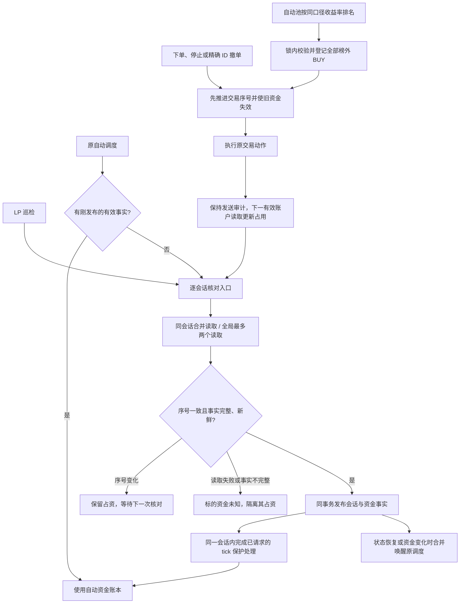

# Prediction 套利

本上下文定义预测市场中关系发现、组合证明、机会展示和交易授权使用的核心业务语言，避免把发现来源、数学结构和执行权限混为一谈。

## Language

**策略类型**:
一个套利机会唯一归属的产品控制边界，取值为 YES/NO 套利、LLM 关系套利或 N 腿套利；它决定哪个策略模式控制该机会。
_Avoid_: 发现来源、交易所类型、腿数标签

**YES/NO 套利**:
现有固定互补合约策略产生的套利机会，包括由该既有策略明确拥有的同所或跨所 YES/NO 组合。
_Avoid_: 所有两腿组合、所有跨所组合

**LLM 关系套利**:
现有 LLM 两腿关系策略产生的套利机会；LLM 发现的新通用关系不因此自动归入本策略。
_Avoid_: 所有 LLM 发现、N 腿套利

**N 腿套利**:
由新通用关系目录拥有的组合套利策略；N 表示底层框架允许任意腿数，而不是要求机会至少三腿。
_Avoid_: 三腿套利、LLM 发现来源

**发现来源**:
关系最初由交易所元数据、确定性规则、LLM 或人工中的哪一种方式提出；发现来源不决定策略模式。
_Avoid_: 策略类型、证明等级

**候选关系**:
已经被发现但尚未获准进入正式关系目录的逻辑关系；它不是已证明套利机会。
_Avoid_: 套利信号、可下单机会

**已批准关系**:
与特定市场及结算规则指纹绑定、获准参与持续监控和组合证明的关系；规则指纹变化后批准立即失效。
_Avoid_: 永久批准、批准某次订单

**关系指纹**:
唯一标识关系所引用市场、结算规则版本和逻辑约束的稳定身份，用于失效、去重和审计。
_Avoid_: 机会 ID、订单 ID

**套利组合**:
由一条或多条交易腿、允许的结算状态和约束共同定义的候选交易整体。
_Avoid_: 单个市场、关系本身

**交易腿**:
套利组合中的一个明确买卖动作，绑定交易所、账户、合约、方向、结算资产和数量。
_Avoid_: 市场关系、订单回执

**允许结算状态**:
交易所规则可能产生的正常或异常终态及其赔付，包括 YES、NO、取消、无效、退款和特殊拆分赔付。
_Avoid_: 只枚举正常结果、预测概率

**保证最低利润**:
在所有允许结算状态下的最低赔付，扣除最坏可执行成本、费用、滑点与安全余量后仍可保证的利润下界；实际利润可以更高。
_Avoid_: 预期利润、理论价差、无风险利润

**结算赔付无亏损**:
保证最低利润不小于零时对结算结果风险的限定描述；它不覆盖部分成交、交易所违约、规则错误、稳定币或操作风险。
_Avoid_: 完全无风险、必赚

**证明等级**:
说明保证最低利润如何获得和复核的可信度等级；当前统一运行标准为 SOLVER_VERIFIED，FORMALLY_VERIFIED 是可选的更强等级。
_Avoid_: LLM 置信度、策略模式

**SOLVER_VERIFIED**:
规范模型在保守数值规则下取得已闭合最优边界，并由独立校验路径复核输入、约束、赔付和结果的证明等级；它不是形式化定理证书。
_Avoid_: 形式化证明、求解器找到可行解

**FORMALLY_VERIFIED**:
求解结果附带可由独立证明检查器验证的机器证书的证明等级。
_Avoid_: 零 gap、重复运行求解器

**可下单机会**:
已通过关系批准、统一证明、实时价格、深度、余额和执行风险检查，当前能够生成有效执行计划的套利机会。
_Avoid_: 数学成立但不可执行、待批准关系

**机会 Episode**:
同一组合从首次满足展示或下单条件到条件失效的一段连续生命周期，用于记录观察数据而不是保存每一个行情 tick。
_Avoid_: 行情快照、订单

**策略模式**:
每个策略类型独立持有的观察/人工确认或自动交易状态；模式不改变发现、证明和风险标准。
_Avoid_: 全局熔断、监控开关

**观察／人工确认**:
完成与自动交易相同的发现、证明和执行前检查，但真实订单必须由用户确认的策略模式。
_Avoid_: 低标准验证、关闭监控、自动毕业期

**自动交易**:
通过统一安全链路后允许系统提交真实订单的策略模式；只有用户显式批准后才能进入。
_Avoid_: 自动批准关系、绕过安全检查

**修复损失**:
组合部分成交后，通过补齐或退出恢复受控仓位时，在保守价格下可能承受的最坏损失。
_Avoid_: 保证最低利润、正常滑点

**全局熔断**:
优先于所有策略模式、一次禁止全部真实订单提交和自动修复的紧急控制。
_Avoid_: 第四个策略开关、停止行情监控

## LP 竞争事实

**竞争事实**：特定市场在一次官方读取中取得的竞争值及其真实检查时间；未取得事实是 UNKNOWN，明确取得的零值仍是零。
_Avoid_: 当前轮必需数据、未知按零处理

**已提交竞争批次**：作为一个整体成功保存的一组竞争事实；同组事实对一次排序读取保持整体可见性。
_Avoid_: 整轮更新完成、部分写入即成功

**竞争排序快照**：一次排序使用的稳定竞争事实集合，可以包含不同刷新轮次的已提交事实；未更新市场保留最后成功事实及其来源和陈旧标记。
_Avoid_: 全市场同时重新读取、必须本轮更新才能排序

**竞争刷新恢复进度**：已经成功保存的竞争事实与尚未完成的读取位置；不包含退出前仅已读取、尚未提交的事实。
_Avoid_: 原始读取结果精确续传、读取完成即提交完成

## LP 会话核对

**自动池预算**：当前持仓和有效 BUY 挂单的占用上限，按配置值执行（本次为 100 USDC），不随历史已实现盈亏增减。
_Avoid_: 复利本金、历史累计损失额度

**自动 BUY 盘口档位**：`buy_price_level` 只接受整数 1 或 2；旧存储文档缺少该字段时默认 1，后续配置请求省略字段时保留当前选定值。档位 1 是最高正深度买价；档位 2 是按价格降序排列的第二个不同正深度买价，同价行合并、零深度行忽略，不用固定 tick 推算。
_Avoid_: 用买一减一个 tick、把零深度或重复价当成新档位、缺档回退买一

**当前资金占用**：完整、新鲜的账户 API 返回的持仓成本与有效 BUY 未成交部分占款之和。SELL 使用已有库存，不再重复占用 USDC；历史请求或报表差异不构成额外占用。
_Avoid_: 历史请求金额、历史成交重建余额

**LP 会话**绑定一个市场的一个结果 token，归集这一轮开仓及后续退出的精确订单 ID、成交和持仓；同一会话可以有多张订单。
旧 BUY 缺少原始数量或终态证明时保留 UNKNOWN；`group_fill_collect` 保留会话指定的当前被动 SELL，其他自有历史 SELL 仍按原身份、时效及代次校验清理，未知前置状态不授权替代退出。

**交易事实序号**由持久化交易动作和回执推进。奖励、评分及展示更新不推进该序号；读取开始与发布时序号不同，旧资金快照作废。会话事实和自动资金账本在同一个 SQLite 事务发布。

资金确认有效期为 60 秒，普通刷新进行中不主动抹掉仍有效的确认。失败、过期或未核清的交易变更阻止受影响标的新 BUY。自动池对可确认归属、仅含原始有界 BUY 的异常会话保留整个原始本金及已知占资，不将未知卖出收入或利润计入可支出下限；独立 UNKNOWN SELL 继续保留 UNKNOWN 审计且不计入未确认回款，但单独不增加 BUY 名额或阻止其他标的在有效资金下补位；其他标的可使用该下限继续提交，完整资金状态仍标 UNKNOWN。身份冲突、会话丢失或无法约束的额外 BUY 仍阻止账户新增买单；原有更严格的行情与提交检查继续生效。自动调度复用 10 秒内刚发布的核对结果，显式核对仍会重新读取。

**账户事实与临时预留**：LP 专用账户的完整余额、挂单、成交和持仓是财务来源，包含手动订单。每轮先准备所有订单的纳管资料，再在同一 SQLite 事务登记订单、发布账户占用并标记已覆盖的临时预留；任一发布失败时整轮回滚。有效读取必须在相关本地发送结束、超时，或独占 runtime owner 交接确认旧本地发送已结束（发送器完成关闭或进程退出）后开始，且通过账户身份、完整分页、新鲜度、交易代次与会话版本校验。自动入场、手动入场与独立增仓 BUY 共用这一覆盖边界，旧 pending/preparing/sending 字段不永久否定新账户事实。正常关闭先阻止新请求发送，再等待已进入签名、POST 或回执应用的本地发送完成；发送仍在途时保留 owner 与账户资源并报告停止未完成，HTTP handler 不是忽略发送的理由。owner 交接证据在启动新发送器前记录，并绑定原动作与会话请求身份；API 登记新增订单身份不等于新发送，但后续新请求不能沿用旧证据。一次有效读取即可覆盖已结束请求；读取期间新发出的请求和仍在发送的请求继续保留临时占位。空账户也必须经过相同校验，不能由缓存或读取失败推定为空。

覆盖标记只解除临时占资，不把原请求改写为 rejected，不推定原请求对应任何订单；UNKNOWN 审计和发送防重记录永久保留。若已覆盖会话没有当前真实挂单、库存或独立在途动作，只结束其空管理生命周期并记录原因，允许后续同 token 正常补位；这不证明原请求被拒绝。历史记录缺少发送时间时，仅在已有持久证据证明同一账户且发送不在途时适用迁移，否则保留占位并报告。迟到回执、重复同步和重启不得恢复已覆盖的原始预留。账户事实失效时等待新读取，不恢复旧预留，也不允许新增买单。

**手动预留豁免**是操作者针对当前自动池历史 UNKNOWN 临时入场占位的显式本地决定，
与账户事实覆盖不同。它不要求恢复缺失的请求归属或旧发送结束时间，不证明原请求未受理。
当前进程准备、排队或发送、明确外账户、可靠订单身份及独立未决动作仍排除；重启后旧 reserved/sending/pending 字段本身不证明活动操作。
原本地预留金额缺失也可显式豁免，原字段和单条审计保留 null；本次释放包含未知金额时汇总为 null，不补造零或金额。
确认单笔 intent ID 或本次选择的全部可释放记录后，在同一事务保留原 UNKNOWN 请求/动作/金额历史，
另写操作者、时间、选择、理由和原审计快照。只豁免临时资金和 BUY 名额，退役旧空请求容器的本地排除；
不写入账户覆盖证明、拒绝、零库存或利润。重复调用、重启、核对与迟到回执不恢复原预留，
真实订单和库存按当前账户 API 计账；历史盈亏只作报表，不增减固定配置预算。启用池唤醒正常调度，暂停池不启用；
当前账户资金或成本未知、预算不足仍阻止新增；历史报告未知不否定有效当前敞口。有效空 API 发布后，旧正数库存字段作为审计保留，不重新阻挡已豁免容器的正常补位。迟到订单可造成短暂超额，沿用现有补录与轮换规则。
接口和边界见 [历史预留 API](../../operations/polymarket-lp-reservation-api.md)。

BUY 名额按当前账户 API 返回的未完成 BUY 订单 ID 计算，同一 token 的两张 BUY 占两个名额，持仓不占 BUY 名额。有效 API 中精确 order ID、token 与 BUY side 相同的敞口只计一次，原本地 UNKNOWN 金额与历史库存不重复占资；当前未成交余量及持仓成本分别按 API 计入。真正独立的未决 BUY 继续单独保留名额与占资，包括 accepted_without_order_id 和无订单 ID 的 accepted；自动与手动入场均保留该保护；动作按持久角色及明确操作身份区分，操作者幂等键中的 cancelable 或 entry-submit 不改变增仓/卖出请求的类型，真实撤单不产生新 BUY 占位。同一类型判断用于预留豁免、空会话退役、轮换撤单集合、核对与审计；无 ID 的独立 accepted BUY 不得被豁免或退役，增仓幂等键不得产生撤单请求事件或撤单回执。无法约束其金额时明确阻止新增；独立 SELL 不增加 BUY 名额或未确认资金占位，仍保留 UNKNOWN 审计且不得把未知回款计入资金。持仓数量与成本以当前 API 为准：优先使用其成本金额，缺少金额时使用其当前数量和平均成本价；本地历史成交数量不否定 API 持仓。固定预算减去实际持仓成本和有效 BUY 未成交部分占款，得到可新增额度，提交时仍受实际余额、allowance 与行情约束。API 明确可兑付、价格及价值均为零的已结算残留不再占用资本；仅展示零市值或不接受交易不能作此判断。

历史成交、费用或收益资料缺失和冲突，只影响报表可靠性，不扩大或缩小预算，也不阻断当前账户资金确认。当前 API 身份、完整性、新鲜度、持仓成本或有效订单本身不明确时，仍等待新的有效读取。完整有效的新账户快照中已经不存在的 BUY 不由旧撤单审计重新生成占位，原撤单结果仍按事实保留。发现超额时先完整登记并停止新增，再按既有收益率规则收敛 BUY，不为凑名额强卖库存。一次读取可能尚未看见迟到订单；用户接受正常补位后短暂超额，后续补录、重算并收敛。

缺失的挂单列表不等于确认无挂单。成交状态或订单归属缺失、maker 子记录无法解析时，适配器保留未知边界，不能静默丢弃记录后按零成交结清。历史成交确认状态影响报告中的成交与收益，不替代当前账户持仓；明确失败的成交按原规则不计入报告成交量。

收益率轮换先完成整批撤单登记，再释放执行锁和 LP 锁逐笔发送精确 ID 撤单。同批第一笔造成的 UNKNOWN 不会打断其余撤单；撤单仍未核清时保留原预占，每个待轮换订单在新的完整有效账户快照中不再挂单后，更新实际占资与名额；其余未核清订单继续保留占资，不阻止已核清名额按当前候选补位。期间有成交则保留真实会话成交事实，终态核清后计入库存成本，中止该轮对应替换。

只有全部订单终态、没有未决提交、零库存且费用和资金已知的历史会话退出高频读取。缺少成交发生时间的报表事实由现有自然日报线程每 300 秒补读一次，同一时间最多一个历史读取，为活动会话保留读取容量，仅补报表事件，不把后来同 token 的新持仓归入旧会话。

已持久化的终态订单保留完整身份和成交审计，普通会话核对不再反复查询其订单状态；当前挂单优先于历史回执，未决订单继续查询。
