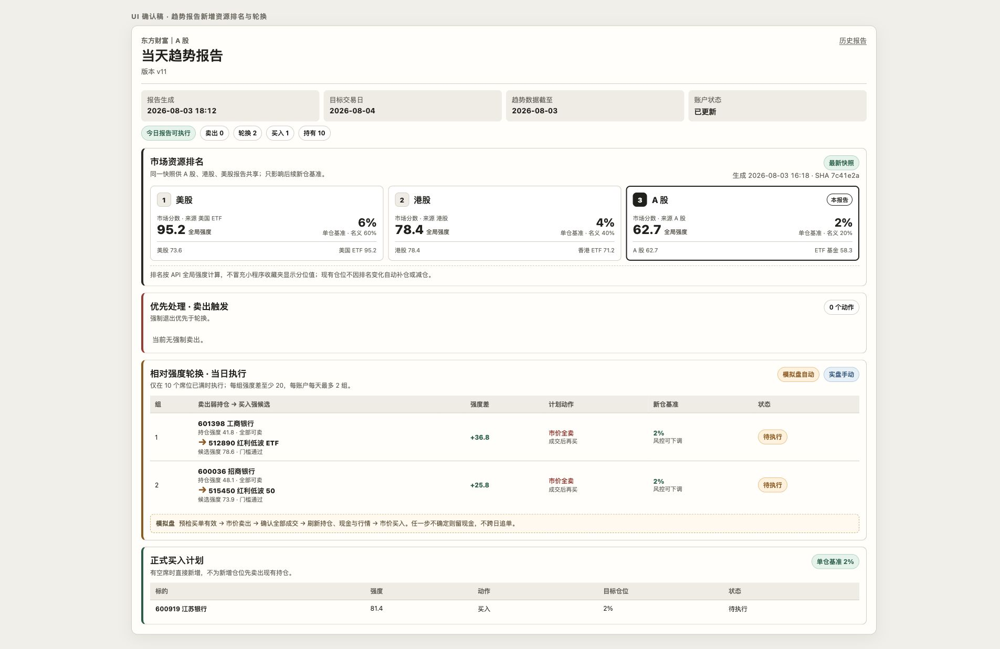
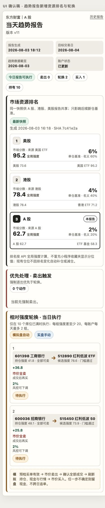

# 三市场资源排名与相对强度轮换设计

## 状态

- 设计日期：2026-08-03
- 基线：本地 `main`，`f4983487a5249ea3fd82ab9e813fd5656ae58736`
- 策略范围：A 股、港股、美股的实盘专用账户与模拟盘专用账户
- UI：桌面与手机确认稿已由用户确认
- 本文只定义设计，不授权实盘自动下单

## 背景

当前三市场趋势报告使用固定 10 个持仓席位，普通新仓基准为账户净值的
4%。报告已有趋势动物强度、候选筛选、Kelly、单次风险、组合风险、现金、
手数、强制退出、模拟盘自动执行和实盘执行辅助，但没有一个跨市场的上游
资源排名，也不会在席位已满时主动把弱持仓换成更强候选。

趋势动物小程序收藏夹中的“强度”是收藏池内的排名分位，不是 snapshot
接口的直接字段。第一方 API 和指南提供了实现本需求所需的稳定事实：

- `getFavoritesTicker` 返回收藏标的及 `tmId`；
- `getTickerSnapshot` 可批量返回 `trendStrengthGlobalCurr`；
- `trendStrengthGlobalCurr` 的大小顺序支持 A 股、港股、美股及 ETF 的跨大类
  比较；
- 小程序收藏夹的逐项整数还受到页面全集、分位公式、并列与舍入影响，第一方
  没有公开唯一算法。

因此本设计不伪造小程序显示的具体整数。资源排名、候选比较和 20 点轮换门槛
都使用 API 原始 `trendStrengthGlobalCurr`，报告明确标注“全局强度”。

## 目标

- 每个 A 股交易日收盘后生成一份三市场共享的资源排名快照。
- 同时考虑股票大类和 ETF 大类：
  - A 股：`A股`、`ETF基金`
  - 港股：`港股`、`香港ETF`
  - 美股：`美股`、`美国ETF`
- 按资源排名把后续单个新仓基准设置为 6%、4%、2%。
- 在席位已满且存在明显更强候选时，每市场、每账户、每目标交易日最多提出
  两组相对强度轮换。
- 模拟盘在报告目标交易日自动执行轮换；实盘只提供可操作建议，由用户手动
  下单。
- 三市场 Markdown、飞书和 Dashboard 都投影同一份冻结报告，不在展示层
  重算排名、仓位或轮换。
- 新策略版本继承现有 Kelly 样本和回撤基线，不重新积累。

## 非目标

- 不抓取或逆向小程序，也不承诺复刻收藏夹显示的逐项整数。
- 不扫描全市场寻找轮换标的。
- 不把 60%/40%/20% 变成账户硬上限，也不因排名变化机械再平衡旧仓。
- 不给实盘控制器增加自动买卖权限。
- 不新增数据库、消息队列、通用工作流引擎或第二套趋势动物客户端。
- 不重做 Dashboard 导航、视觉系统或整个趋势报告布局。
- 不修改现有强制退出、入场门槛、Kelly、单次风险、组合风险和保护线的业务
  含义；它们继续拥有降低或阻止仓位的权力。

## 核心术语

| 术语 | 定义 |
| --- | --- |
| 资源根分类 | 六个用于跨市场资源判断的趋势动物大类：三市场股票与对应 ETF |
| 市场分数 | 一个市场两个根分类的 `trendStrengthGlobalCurr` 最大值 |
| 分数来源 | 产生市场分数的股票或 ETF 根分类 |
| 资源排名 | 三个市场按市场分数降序得到的第一、第二、第三名 |
| 单仓基准 | 当前排名对应的单个新仓基础比例：6%、4%、2% |
| 名义仓位 | 10 个席位都按当前单仓基准建仓时的 60%、40%、20%，仅用于解释 |
| 普通买入 | 账户仍有空席时，由现有报告候选和门槛产生的买入 |
| 相对强度轮换 | 席位已满时，全卖弱持仓并在确认成交后买入更强候选的一组配对动作 |
| 目标交易日 | 报告指定执行的市场交易日，不等于报告文件自然生成日 |

## 总体架构

```text
趋势动物免费更新状态 + 收藏夹/根分类身份 + 批量全局强度
                              |
                              v
                 trend-allocation 专用任务
                              |
                              v
           一份不可变资源排名快照（路径 + SHA-256）
                    /         |          \
                   v          v           v
              A 股报告     港股报告      美股报告
                   |          |           |
                   +----------+-----------+
                              |
            冻结报告：仓位、轮换、日期、快照 SHA
                    /                     \
                   v                       v
       模拟盘控制器自动执行             实盘手动执行辅助
                   |
                   v
       Markdown / 飞书 / Dashboard 只读投影
```

`trend-allocation` 是唯一资源排名生产者，只生成排名快照，不生成市场报告、
不读取券商交易账户、不下单，也不发送正常趋势日报。三个市场任务必须通过明确
的快照路径和 SHA 依赖它，不能让首个运行的市场报告顺便生成共享参数。

## 资源排名任务

### 调度

- 只在 A 股交易日运行。
- 运行窗口位于 A 股收盘之后、三市场下一份报告生成之前，并等待本次所需的
  A 股与港股根分类数据完成；美股使用其最近已完成交易时段的数据。
- A 股或港股休市造成来源交易日不同是允许的，但每个根分类必须记录自己的
  `as_of_date`。
- A 股休市日不生成新快照，三市场报告继续使用最后成功快照。
- 当前美股报告从上海时间中午调整到该任务之后生成，使三市场下一份报告引用
  同一快照 SHA。美股目标交易日仍是当晚对应的美股交易时段。

### 输入与获取

任务复用现有 `TrendAnimalsClient` 的认证、批量 snapshot、缓存、日期校验和
日志脱敏能力，只新增最薄的收藏夹读取或根分类定位入口。不得把 API Key、
完整 query URL 或账户收藏内容写入日志。

每次只请求实际需要的字段，资源根分类最小字段为：

```text
tmId,tickerName,asset,asOfDate,trendStrengthGlobalCurr
```

标的按已验证的 `tmId` 连接，不能在每次运行中只凭名称猜测身份。候选强度在
各市场报告生成阶段按候选 `tmId` 批量请求；资源排名任务不提前扫描三个市场
的全部候选。

### 排名算法

对每个市场计算：

```text
market_score = max(stock_root.global_strength, etf_root.global_strength)
score_source = argmax(stock_root.global_strength, etf_root.global_strength)
```

然后按以下顺序确定排名：

1. `market_score` 降序；
2. 若最高分相同，比较该市场另一个根分类的强度，较高者优先；
3. 两个根分类仍完全相同，沿用上一份成功快照中的相对顺序。

不增加分差缓冲、连续两日确认或平滑指标。每日快照直接重排；由于排名变化
不会自动调整旧仓，已有持仓本身就是防止频繁再平衡的缓冲。

首次启动若没有上一份成功快照，并且完整的二级比较后仍无法打破市场并列，
不凭市场代码任意分配 6%/4%/2%。本次生成失败，沿用功能启用前的既有策略，
直到产生第一份可确定排名的成功快照。

### 快照文件

使用简单的不可变 JSON 文件，不新增数据库：

```text
data/trend_allocation/daily/YYYY-MM-DD.json
data/trend_allocation/latest.json
data/trend_allocation/controller_status.json
```

每日文件是事实；`latest.json` 是原子替换的小型指针，只保存最后成功每日文件
的仓库相对路径和内容 SHA-256。报告冻结每日文件路径及内容 SHA-256，不能只
读取会移动的 `latest.json`。

```json
{"daily_path": "data/trend_allocation/daily/2026-08-03.json", "sha256": "<sha256>"}
```

最小结构：

```json
{
  "version": 1,
  "allocation_date": "2026-08-03",
  "generated_at": "2026-08-03T16:18:00+08:00",
  "generator_version": "trend-allocation-v1",
  "git_sha": "<sha>",
  "roots": {
    "CN": {
      "stock": {"asset": "A股", "tm_id": 1, "as_of_date": "2026-08-03", "global_strength": "62.7"},
      "etf": {"asset": "ETF基金", "tm_id": 2, "as_of_date": "2026-08-03", "global_strength": "58.3"}
    },
    "HK": {},
    "US": {}
  },
  "markets": {
    "US": {"rank": 1, "score": "95.2", "score_source": "美国ETF", "entry_weight": "0.06", "nominal_weight": "0.60"},
    "HK": {"rank": 2, "score": "78.4", "score_source": "港股", "entry_weight": "0.04", "nominal_weight": "0.40"},
    "CN": {"rank": 3, "score": "62.7", "score_source": "A股", "entry_weight": "0.02", "nominal_weight": "0.20"}
  }
}
```

实际 schema 必须要求六个根分类完整、六个强度可解析、每个来源有日期、三个
市场各出现一次且排名为 1/2/3。所有金额和比例继续使用项目现有的十进制字符串
约定，避免浮点数漂移。

### 重跑与不可变性

- 在没有成功文件时，任务可安全重试。
- 成功文件写入后，同一输入重跑必须产生相同业务内容并返回同一快照。
- 某周期快照一旦被任一下游报告引用，该内容不可原地替换。
- 必须修正时生成明确的新修订，并让三市场报告一起重生成；不能只让一个市场
  悄悄使用新排名。

## 缺失、失败与陈旧快照

六个根分类构成一个整体。任一项缺失、不可解析或不满足该市场最近已完成数据
要求时，本次任务不发布“五项新 + 一项旧”的混合快照。

如果已有成功快照：

- 整体沿用上一份 1/2/3 排名与 6%/4%/2% 单仓基准；
- 普通买入、轮换和持仓管理不冻结；
- 报告标记“沿用旧排名”、原快照日期、陈旧 A 股交易日数和失败原因摘要；
- 从首次失败起发送任务异常告警，成功生成新快照后恢复正常；
- 不设置“陈旧 N 天后自动停买”的额外门槛。

如果系统从未产生过成功快照，资源排名功能不能凭空给出 6%/4%/2%。现有版本
的 4% 普通策略和强制退出可继续，资源排名版本的报告和轮换不得声称可执行。

某个具体持仓或候选缺少 `trendStrengthGlobalCurr` 时，只把该标的排除出轮换
比较；不影响其他标的，也不拿收藏夹显示分位、`trendStrengthLocalCurr`、零值
或默认值代替。该标的其他既有策略动作保持原行为。

## 仓位规则

### 专用账户与席位

A 股、港股、美股分别拥有专用实盘账户和专用模拟盘账户。每个账户固定最多
10 个持仓席位。三市场共享资源排名，但实盘与模拟盘按各自账户净值、持仓、
现金、空余席位和风控独立计算。

资源排名只决定单个新仓的基础比例：

| 市场排名 | 单仓基准 | 10 席位名义仓位 |
| ---: | ---: | ---: |
| 1 | 6% | 60% |
| 2 | 4% | 40% |
| 3 | 2% | 20% |

股票和 ETF 使用相同基准。即使某市场因为 ETF 强度成为第一名，该市场通过
自身入场门槛的股票候选也使用 6% 基准。

### 不是硬上限

60%/40%/20% 只是 10 个新仓都按当前排名建仓时的名义结果，不是账户总仓位
硬上限：

- 市场从第一名降到第三名，不机械卖出或缩减已有 6% 仓位；
- 市场从第三名升到第一名，不自动把已有 2% 仓位补到 6%；
- 即使旧仓使当前总仓位高于名义仓位，只要账户未满 10 个席位，仍可按当前
  6%/4%/2% 基准新增；
- 排名变化只影响之后的普通新仓和轮换买入；
- 轮换卖出旧 6% 仓位而当前基准为 2% 时，新候选只按 2% 建仓，多余资金留在
  现金中。

最终计划数量继续由现有约束取更小值：

```text
当前排名单仓基准
  ∩ Kelly 上限
  ∩ 单次入场风险
  ∩ 组合风险余量
  ∩ 可用现金
  ∩ 市场手数与最小订单
```

资源排名只能提高或降低基础计划，不能绕过任何已有入场、流动性、右侧结构、
保护线或账户完整性规则。

## 候选池与轮换判定

### 候选池

每个市场的轮换候选池是：

```text
该市场收藏标的 ∪ 当期报告推荐标的
```

连接、去重后，候选必须同时满足：

- 属于该市场允许的股票或 ETF 大类；
- 有唯一、双向验证的趋势动物与券商标的映射；
- 当前未被该账户持有；
- 拥有可解析的 `trendStrengthGlobalCurr`；
- 通过当期报告的全部现有正式入场门槛；
- 能在当前价格、当前现金加保守预计卖出净所得、手数和风险规则下形成非零有效
  买单。

报告推荐标的不需要自动加入用户的趋势动物收藏夹。系统只读取其 snapshot
强度参与比较，不修改账户收藏状态，也不额外扫描全市场。

### 可被轮换的持仓

只选择当期完整信号结论为 `HOLD` 的当前持仓。以下标的不进入弱持仓池：

- 已触发强制退出或保护动作；
- 待确认、待成交或订单状态不确定；
- `MANUAL_REVIEW`、身份不唯一或数据不完整；
- 缺少全局强度；
- 不是该账户当前真实持仓。

### 动作优先级

```text
强制退出
  -> 刷新退出后席位
  -> 有空席：执行普通买入，不为新增仓位额外卖出
  -> 仍满 10 席：评估相对强度轮换
```

强制退出释放席位后，强候选走普通买入，不再制造一笔不必要的弱仓卖出。

### 配对算法

1. 合格持仓按全局强度升序排列；
2. 合格未持有候选按全局强度降序排列；
3. 最弱持仓配最强候选，次弱持仓配次强候选；
4. 每组必须满足：

```text
candidate.global_strength - holding.global_strength >= 20
```

5. 每个候选只能出现在一组中；
6. 每市场、每账户、每目标交易日最多两组；
7. 两组互相独立，一组失败不阻止另一组；
8. 不增加被轮换标的冷却期。它若在未来报告重新成为最强合格候选，并再次
   满足 20 点优势，可以重新买入。

两组上限按“市场 + 账户 + 目标交易日”累计，报告重生成或修订不能把上限
清零。并列标的使用冻结报告中的稳定顺序和代码作为最终确定性排序，不改变
20 点业务门槛。

## 报告冻结与账户独立性

资源排名快照对三市场共享；轮换计划对实盘和模拟盘分别生成，因为两类账户的
持仓、现金与风险可能不同。冻结报告必须分别保存：

- `simulate_rotation_pairs`：模拟盘自动执行计划；
- `real_rotation_pairs`：实盘手动执行建议；
- 每组持仓与候选的身份、冻结强度、差值、数量基础、目标仓位、原因和顺序；
- 资源快照路径、SHA、生成时间、来源交易日和是否沿用旧排名；
- 报告生成时间与目标交易日。

执行控制器不得在下单前重抓强度或临场换配。它只刷新账户持仓、现金、行情、
交易时段、订单和成交状态。若执行前账户状态改变，例如弱持仓已卖、候选已持有
或席位状态不同，跳过受影响组并记录原因，下一份报告再计算。

## 模拟盘轮换状态机

实盘永远不进入本状态机。模拟盘每组执行：

```text
冻结配对
  -> 执行前账户与交易时段校验
  -> 预检候选能形成非零买单
  -> 市价卖出弱持仓全部可卖数量
  -> 对账并等待卖单全部成交
       |-- 部分成交 / 失败 / 不确定：不买，记录未完成
       `-- 全部成交
              -> 刷新持仓、现金、实时行情与风险
              -> 按当前报告冻结的单仓基准计算买入数量
              -> 市价买入强候选
                   |-- 全部成交：完成
                   |-- 部分成交：保留已成交仓位，不追补
                   `-- 完全未成交且时段仍有效：幂等重试一次
```

### 卖出与买入

- 轮换卖出为市价单，数量是该弱持仓的全部可卖数量。
- 提交卖单前先用当前行情、当前现金和保守预计卖出净所得预检配对买单至少为
  一手或一股；若预计数量为零，整组不卖。
- 只有券商订单事实明确证明卖单全部成交，才允许提交配对买单。
- 卖单部分成交、失败、被拒或状态不确定时，禁止配对买入。
- 卖单全部成交后必须重新读取账户、现金和实时行情，再按冻结报告的当前排名
  基准及所有现有风控计算数量。
- 买入使用现有趋势模拟盘的市价下单路径。买单部分成交时保留已成交数量，
  标记“部分完成”，不自动补足目标仓位。

### 时间边界

“报告当天执行”指报告的目标交易日：

- A 股和港股报告在下一目标交易时段执行；
- 美股报告在上海时间当晚对应的目标交易时段执行；
- 轮换买入可在该市场连续交易时段内完成，不受普通 A 股 09:30–10:00 新仓
  截止限制；
- 若卖单临近收盘成交，但已经没有足够时间取得有效行情并安全提交买单，当天
  留现金；
- 不跨目标交易日补买，也不把未完成配对携带到下一份报告。

### 幂等与崩溃恢复

每组使用稳定身份：

```text
market + account_id + target_trade_date + report_sha256 + pair_index
```

订单 remark、意图、对账结果和动作账本都带该身份。控制器重启后：

- 若同一交易日内可以证明卖单全部成交、买单尚未提交且市场仍开放，继续完成
  该买单；
- 若状态不确定，绝不猜测或重复下单；
- 若已经跨日，标记未完成并留现金；
- 同一身份最多完成一次卖出和一次成功买入；
- 完全未成交的买单只有在订单状态明确、市场仍开放且没有同身份有效订单时，
  才允许重试一次。

## 实盘执行辅助

实盘报告使用实盘账户自己的持仓和风险状态生成最多两组建议，但不创建订单
意图、不调用交易 API、不等待用户回填成交。每组明确展示：

- 全卖的弱持仓、冻结强度与原因；
- 拟买入候选、冻结强度与至少 20 点差值；
- 当前排名对应的 6%/4%/2% 单仓基准；
- Kelly、风险、现金和手数可能下调的最终建议；
- “市价卖出全部成交后再买入”的人工顺序；
- 目标交易日和“错过不跨日补单”。

用户实际操作与建议不同，由下一份报告根据最新实盘持仓重新判断；系统不把
实盘手动动作伪装为模拟盘自动执行结果。

## 策略版本、Kelly 与回撤

本次是可兼容的策略修订：

- A 股：v10 -> v11
- 港股：v8 -> v9
- 美股：v8 -> v9

版本升级不重新积累：

- 新版本继承所有现有符合资格的历史 Kelly 样本；
- 现有回撤高水位、基线、暂停状态和恢复状态连续；
- 旧版本开仓、新版本平仓的交易仍归入其开仓策略样本链；
- 同时记录 `opening_strategy_version`、`closing_strategy_version` 和
  `exit_reason`；
- 相对强度轮换卖出使用 `exit_reason=relative_rotation`，并作为真实完成交易
  计入 Kelly 样本；
- 新轮换交易进入同一兼容继承链，不另建空白实验。

## 报告、飞书与 Dashboard

### 信息层级

趋势报告顺序为：

1. 报告标题与日期事实；
2. 市场资源排名；
3. 强制卖出；
4. 相对强度轮换；
5. 普通正式买入；
6. 持有、复核、行业、纪律、风险与审计等现有区域。

资源排名区展示：

- 三市场 1/2/3 排名；
- 六个根分类原始全局强度；
- 每个市场的分数来源；
- 6%/4%/2% 单仓基准；
- 60%/40%/20% “10 席位名义仓位”标签；
- 当前报告市场；
- 快照状态、生成时间、来源交易日与 SHA；
- “全局强度不等同小程序收藏夹显示值”的口径说明。

轮换区分别标识“模拟盘自动”和“实盘手动”。若两类账户的配对不同，使用两个
明确分组或账户标签，不能用同一行暗示实盘与模拟盘持仓相同。每组同时以文字
和颜色展示卖出、买入、差值、目标比例和执行状态。

### 陈旧与异常

正常快照显示“最新快照”。沿用历史排名时改为琥珀色状态：

```text
沿用旧排名 · N 个 A 股交易日
原快照 YYYY-MM-DD · 本次更新失败
```

颜色不是唯一信息，文字、日期和原因必须同时存在。Dashboard、Markdown 和
飞书都使用报告冻结字段，不从 `latest.json` 或趋势动物 API 重新计算。

### 已确认 UI

桌面：



手机：



实现保持现有暖色、高密度、细边框报告视觉，不引入字体、图标或组件依赖。
桌面三市场横排；手机纵向排列市场卡和轮换组，不产生整页横向滚动。交互目标
保持至少 44px，状态不能只靠红绿颜色区分。

## 通知与运行状态

- `trend-allocation` 成功时只更新状态，不额外制造一条正常通知噪声。
- 首次失败及持续陈旧状态进入运行异常告警；恢复成功时发送一次恢复状态。
- 三市场日报各自展示共享快照 SHA，便于核对是否真正使用同一参数。
- 模拟盘轮换结果按组展示：待执行、卖出中、卖出失败、买入中、完成、部分完成、
  未完成、跳过。
- 实盘始终标记“手动执行辅助”，不能出现“自动下单成功”。

## 安全与一致性约束

- 趋势动物 API Key 继续只从现有本地配置读取并在日志中脱敏。
- 收藏夹读取免费不代表 snapshot 免费；请求去重、批量化并只取必要字段。
- 排名、仓位和配对进入冻结报告哈希；执行开始后不能用报告修订改变已开始批次。
- 实盘与模拟盘共享信号事实，不共享订单状态、账户净值、现金、持仓或数量。
- 所有展示层都是冻结报告的投影，不成为第二个计算或执行所有者。
- 强制退出、账户完整性、订单对账和风险控制优先于“留强汰弱”的收益目标。

## 测试与验收

### 单元测试

- 六根分类完整性、市场取最大值、分数来源和 1/2/3 排名；
- 同分时比较另一根分类，再沿用上一排名；
- 任一根分类缺失时整体沿用上一成功快照，不发布混合快照；
- 6%/4%/2% 只作用于新仓，不触发旧仓自动增减；
- 股票与 ETF 使用同一市场单仓基准；
- 收藏标的与报告推荐标的合并、去重、映射和缺失强度排除；
- 有空席走普通买入，满席才轮换；
- 强制退出优先并释放席位；
- 最弱对最强、至少 20 点、候选不重复、最多两组；
- 实盘与模拟盘按各自持仓独立配对；
- 报告修订不重置目标交易日上限；
- 账户状态变化时跳过而不临场换配；
- 新版本继承 Kelly 样本与回撤状态，轮换退出正确归因。

### 模拟盘执行测试

- 市价全卖，只有全部成交才允许买入；
- 卖单部分成交、失败、被拒和状态不确定时禁止买入；
- 卖出后刷新账户、现金、行情和风险再计算数量；
- 买单部分成交保留已成交量且不追补；
- 完全未成交买单最多同日幂等重试一次；
- 控制器在卖出成交与买入之间重启后能够安全续做；
- 跨日、临近收盘或行情不可用时留现金；
- 两组独立，一组失败不阻止另一组；
- 同一报告、账户、交易日和组不会重复下单。

### 集成与直接工作流

- 用固定输入运行 `trend-allocation`，检查每日快照、latest、状态、SHA 和重跑
  幂等；
- 生成 A 股、港股、美股三份报告，证明快照 SHA 完全相同且目标交易日正确；
- 模拟正常、缺失一根、沿用旧排名、A 股休市和首次冷启动；
- 直接运行三市场报告工作流并检查 Markdown、冻结 JSON 和飞书渲染；
- 用模拟券商订单事实运行完整轮换卖出/成交/买入路径；
- 证明实盘报告生成建议但没有任何 submit 调用；
- 检查 launchd 任务、控制器 PID、工作目录、Git SHA、最新时间戳和日志。

### Dashboard 最终门禁

实现属于 Dashboard 行为和展示变更。开发期间只跑聚焦测试和直接工作流；完成
后必须把 `make acceptance` 作为最后门禁。只有 `PASS` 才可请求用户评审。
PASS 后重新部署完全相同的已验收 Git SHA，并验证新 PID、工作目录、Git SHA、
新日志和评审 URL HTTP 200，再提供 URL。

## 最小实现边界

实现应优先复用：

- `src/open_trader/trend_animals.py` 的客户端、市场资产映射、批量 snapshot、
  缓存和日期校验；
- `src/open_trader/a_share_trend.py` 与 `market_trend.py` 的报告、候选、现有
  入场门槛和策略快照；
- `src/open_trader/trend_review.py` 与 `trend_market_controller.py` 的冻结报告、
  市价订单、订单 remark、账本、对账和模拟盘执行控制器；
- 现有 Dashboard 报告组件和响应式 CSS；
- 现有 launchd 模板、状态文件、日志和异常通知模式。

只新增一个清晰的资源排名模块/CLI、一个 launchd 任务及现有报告/执行路径中
必要的字段和分支。不要为三个市场建立三套排名实现，也不要引入新的调度框架、
状态数据库、通用 DAG、规则引擎或前端组件库。

## 完成定义

- 一份完整或明确沿用历史的共享排名事实进入三市场冻结报告；
- 报告真实展示单仓基准、名义仓位、来源日期和快照 SHA；
- 普通买入、强制退出和轮换优先级符合本文；
- 模拟盘最多两组轮换可在目标交易日安全、幂等执行；
- 实盘只有手动建议且无自动提交路径；
- Kelly 样本和回撤不重置；
- 桌面与手机 UI 符合确认稿及账户独立性要求；
- 自动测试、直接工作流、launchd/进程检查和最终 Dashboard acceptance 全部通过。
